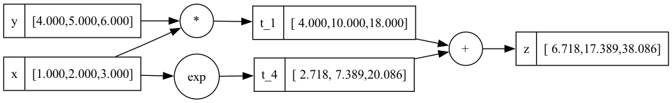

# TinyTorch: A Minimal Automatic Differentiation Library

TinyTorch is a minimal implementation of [automatic differentiation](https://en.wikipedia.org/wiki/Automatic_differentiation) in Python, designed to demonstrate the core concepts behind modern deep learning frameworks like PyTorch. By focusing on essential functionality, it provides clear insights into how automatic differentiation works in practice.

## Features

TinyTorch provides the fundamental building blocks needed for automatic differentiation:
- Tensor operations (+, -, *, /) with automatic gradient tracking
- Neural network activation functions ([ReLU](https://en.wikipedia.org/wiki/Rectifier_(neural_networks)), [sigmoid](https://en.wikipedia.org/wiki/Sigmoid_function), [tanh](https://en.wikipedia.org/wiki/Hyperbolic_functions))
- Broadcasting support for scalar operations
- Type safety through annotations and strict checking
- Comprehensive property-based testing

## Theory and Implementation

### Automatic Differentiation Basics

Automatic differentiation (AD) is distinct from both symbolic and numerical differentiation. While symbolic differentiation manipulates mathematical expressions and numerical differentiation uses finite differences, AD computes derivatives by decomposing expressions into elementary operations and applying the chain rule systematically.

AD has two primary modes:
- **Forward mode**: Computes derivatives alongside values during forward evaluation
- **Reverse mode**: Records operations during forward pass, then computes derivatives backward (this is what TinyTorch implements)

The reverse mode is particularly efficient for functions with many inputs and few outputs, making it ideal for neural networks where we typically compute gradients of a scalar loss with respect to many parameters.

### Building the Computational Graph

Every operation in TinyTorch creates a node in a [directed acyclic graph](https://en.wikipedia.org/wiki/Directed_acyclic_graph) (DAG). When you write expressions like `z = x + y`, TinyTorch automatically tracks these operations through [operator overloading](https://en.wikipedia.org/wiki/Operator_overloading). Each node represents an operation (addition, multiplication, etc.), and edges show how data flows between operations.

### Forward and Backward Passes

During the forward pass, TinyTorch performs the actual computations while building the graph. For each operation, it:
- Computes the result using NumPy
- Creates a new tensor to store the result
- Records the operation type and input tensors
- Defines how to compute gradients for this operation

The backward pass ([backpropagation](https://en.wikipedia.org/wiki/Backpropagation)) is where the magic happens. Starting from the output, TinyTorch:
1. Builds a [topologically sorted](https://en.wikipedia.org/wiki/Topological_sorting) list of operations
2. Sets the initial gradient to 1.0
3. Walks backward through the graph
4. Applies the chain rule at each step

### The Chain Rule in Practice

The [chain rule](https://en.wikipedia.org/wiki/Chain_rule) is the key to automatic differentiation. Each operation knows how to compute its local derivatives, and TinyTorch combines these to compute full gradients. For example, in multiplication (`z = x * y`):
```python
# Forward: z = x * y
# Backward: 
# dz/dx = y  (partial derivative with respect to x)
# dz/dy = x  (partial derivative with respect to y)
```

The chain rule allows us to compute gradients through arbitrary compositions of functions. For a composition like f(g(x)), the derivative is f'(g(x)) * g'(x). TinyTorch extends this to handle multivariate functions and complex computational graphs automatically.

### Broadcasting and Gradient Accumulation

TinyTorch handles two crucial aspects of gradient computation:
- [Broadcasting](https://numpy.org/doc/stable/user/basics.broadcasting.html) allows operations between tensors of different shapes
- Gradient accumulation ensures correct gradients when a tensor is used multiple times in the computation (following the [multivariate chain rule](https://en.wikipedia.org/wiki/Chain_rule#Higher_dimensions))

## Implementation Details

The core of TinyTorch is the `Tensor` class:
```python
class Tensor:
    def __init__(self, data, label=None, _children=None, _op=None):
        self.data = data          # The actual values (numpy array)
        self.grad = zeros_like(data)  # Gradient storage
        self._children = set()    # Input tensors
        self._op = op            # Operation type
        self._backward = lambda: None  # Gradient computation function
```

During backpropagation, TinyTorch performs a topological sort to ensure gradients are computed in the correct order:
```python
def backward(self):
    topo = []
    visited = set()
    
    def _build_topo(v):
        if v not in visited:
            visited.add(v)
            for child in v._children:
                _build_topo(child)
            topo.append(v)
    
    _build_topo(self)
    self.grad = ones_like(self.data)
    for tensor in reversed(topo):
        tensor._backward()
```

## Example Usage

Here's a simple example that demonstrates the key features:
```python
from tinytorch import Tensor

# Create tensors
x = Tensor([1.0, 2.0, 3.0], label="x")
y = Tensor([4.0, 5.0, 6.0], label="y")

# Forward pass builds the computational graph
z = x * y + x.exp()
z.label = "z"

# Backward pass computes all gradients
z.backward()

# Access gradients
print(x.grad)  # dz/dx = y + exp(x)
print(y.grad)  # dz/dy = x

# Render a graph visualization
z.render()
```


*Example of a computational graph showing the forward and backward pass through operations*

## Testing

TinyTorch uses [property-based testing](https://en.wikipedia.org/wiki/Property_testing) with Hypothesis to ensure correctness. The test suite verifies:
- Mathematical properties like commutativity and associativity
- Numerical stability across operations
- Type safety and error handling
- Gradient correctness against PyTorch
- Broadcasting behavior
- Complex computational graphs

## Development

TinyTorch is built with modern Python tools:
- Python 3.11+ for type hints and modern features
- [NumPy](https://numpy.org/) for efficient array operations
- [Ruff](https://github.com/astral-sh/ruff) for formatting and linting
- [MyPy](http://mypy-lang.org/) for static type checking
- [Pytest](https://docs.pytest.org/) and [Hypothesis](https://hypothesis.works/) for robust testing
- [PyTorch](https://pytorch.org/) for gradient verification